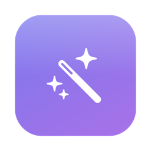
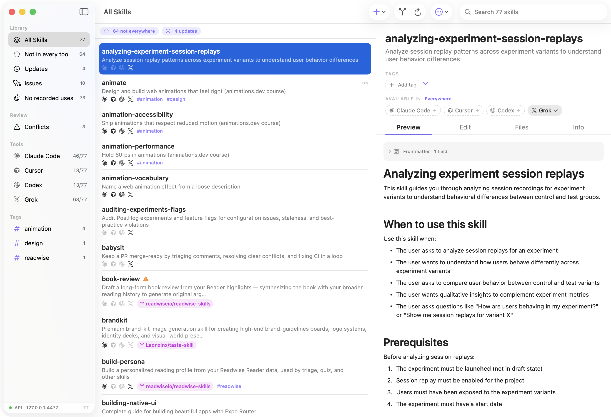

<p align="center">
  
</p>

<h1 align="center">Skill Library</h1>

<p align="center">
  The home for your AI agent skills.<br/>
  A native macOS app that creates, installs, organizes, and syncs <code>SKILL.md</code> folders across
  <b>Claude Code, Cursor, Codex (and the ChatGPT app), Grok, OpenCode, Gemini CLI, and Kiro</b>.
</p>

<p align="center">
  
</p>

> **Identifiers:** The product is **Skill Library**. The GitHub repo, CLI binary, and app bundle
> basename remain `skillhub` / `SkillHub` so clone URLs, Sparkle updates, and scripts stay stable
> (`com.alexnicolai.skillhub`, `/Applications/SkillHub.app`, `SkillHub status`). The same goes for
> on-disk data — the `skillhub.json` manifest, `~/Library/Application Support/SkillHub`, and the
> `skillhub` meta-skill keep their names so existing stores and installs continue to work unchanged.

---

## The problem

If you use more than one AI coding tool, your skills scatter: copies drift apart, you forget what's installed where, upstream updates pass you by, and nothing syncs between machines.

## What Skill Library does

- **One store.** All skills live in a single git repo (`~/ai-skills` by default). Every tool reads them through per-skill **symlinks** — edit once, every tool sees it instantly.
- **Every skill, every tool.** Each row shows which tools can see the skill; the sidebar shows per-tool coverage; **Link Every Skill to Every Tool** (`⇧⌘L`) closes every gap in one click. New skills — created, installed, imported, or approved — land in every detected tool automatically.
- **Create, import & edit.** `⌘N` scaffolds a well-formed skill; `⌘O` (or drag-and-drop from Finder) imports existing skill folders, replacing on request; the raw editor autosaves; `⌘K` fuzzy-jumps to any skill.
- **Install from GitHub.** Browse any repo's SKILL.md folders, cherry-pick, install with provenance wired for updates.
- **Tags, not folders.** Tag skills (or drag them onto sidebar tags), filter instantly, bulk-tag and bulk-remove selections.
- **Updates with diffs.** Skill Library compares skills against their source repos, shows what changed before you update, and guards local edits. The app updates itself via Sparkle.
- **Skill doctor.** Broken frontmatter, dead links, and oversized skills (context-window cost) surfaced automatically.
- **Drift & conflicts.** Diverged tool copies get a badge, a diff, and one-click repair that also absorbs skills living in other stores (e.g. `~/.agents/skills`) — with backups, always.
- **Usage metrics.** Counts skill invocations from Claude Code transcripts; a smart group surfaces never-used skills for pruning.
- **Cross-machine sync.** Commit/push/pull from the toolbar; clone + adopt on your other Macs.
- **Version history.** Every skill's git history in the app, with one-click restore.
- **Agents read — and write.** A localhost API serves the live catalog, and agents can **propose** skills into a review inbox (`POST /skills`). Nothing activates without your approval.

```sh
curl -s http://127.0.0.1:4477/skills
```

### Security

The API binds to loopback only, validates the `Host` header (DNS-rebinding protection), and sends no CORS headers — web pages can't read it. Your GitHub token lives in the Keychain. Updates are EdDSA-signed and releases are notarized.

## Install

**[Download SkillHub.dmg](https://github.com/alexnicolai/skillhub/releases/latest)** → open it → drag **Skill Library** (`SkillHub.app`) to Applications.

Releases are **signed and notarized** (Developer ID), and **Skill Library updates itself**: when a new version ships you get an in-app prompt — click *Install and Relaunch* and you're done. Updates are EdDSA-signed (Sparkle) and served from GitHub releases.

Onboarding walks you through picking (or creating/cloning) your skill store and connecting your tools. Nothing is touched without a timestamped backup.

### Build from source

```sh
git clone https://github.com/alexnicolai/skillhub.git
cd skillhub
./make-app.sh --install   # builds and installs /Applications/SkillHub.app (displays as Skill Library)
```

Requires Xcode 15+ command line tools (macOS 14+).

## CLI

The same binary is a CLI (invoke as `SkillHub`):

```sh
SkillHub status           # per-tool link summary
SkillHub adopt --dry-run  # preview what adopt would do
SkillHub adopt            # import + convert all tools to symlinks
SkillHub verify           # per-tool health check
SkillHub drift            # list divergences
SkillHub updates          # check upstream repos
SkillHub update <name>    # apply one update
SkillHub usage            # per-skill usage counts
SkillHub serve            # headless API server
```

## How it works

```
your-skills-repo/
├── skills/<name>/SKILL.md   ← canonical store
├── skillhub.json            ← manifest: provenance, hashes, per-tool intent
└── .backups/                ← timestamped safety nets (gitignored)

~/.claude/skills/<name>  →  symlink into skills/<name>
~/.cursor/skills/<name>  →  symlink into skills/<name>
…and so on for every tool
```

- `SKILL.md` frontmatter (`name`, `description`) is the same across all tools, so one folder serves everyone. Codex's `agents/openai.yaml` sidecars ride along inside the skill folder — other tools ignore them.
- Tool dirs the app never touches: `~/.cursor/skills-cursor` (Cursor's managed skills) and `~/.codex/skills/.system` (Codex builtins).
- Tools are detected automatically (app bundle, CLI binary, or usage artifacts) and can be forced on or off in Settings → Tools. The ChatGPT desktop app reads Codex's folder; Cursor's Composer reads Cursor's.
- On a machine without Skill Library, the store is just plain folders in git — everything degrades gracefully.

## License

[MIT](LICENSE) — fork it, ship it, make it yours.
